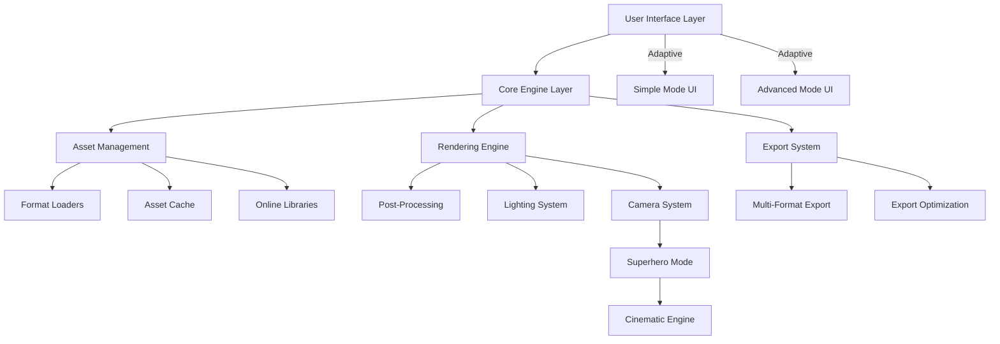

# Design Document

## Overview

The Professional 3D Viewer Enhancement transforms the existing Three.js-based model viewer into a comprehensive, modular, and professional-grade 3D visualization platform. The design emphasizes modularity, extensibility, and user experience while maintaining high performance and supporting both casual users and 3D professionals.

## Architecture

### High-Level Architecture



### Modular Design Principles

1. **Separation of Concerns**: Each module handles a specific aspect of functionality
2. **Loose Coupling**: Modules communicate through well-defined interfaces
3. **High Cohesion**: Related functionality is grouped within modules
4. **Extensibility**: New features can be added without modifying core modules
5. **Testability**: Each module can be tested independently

## Components and Interfaces

### Core Engine (`CoreEngine`)

The central orchestrator that manages all other modules and maintains application state.

```javascript
class CoreEngine {
    constructor() {
        this.renderingEngine = new RenderingEngine(this);
        this.assetManager = new AssetManager(this);
        this.uiManager = new UIManager(this);
        this.exportSystem = new ExportSystem(this);
        this.superheroMode = new SuperheroMode(this);
    }
    
    // Event system for module communication
    emit(event, data) { /* ... */ }
    on(event, callback) { /* ... */ }
    
    // State management
    getState() { /* ... */ }
    setState(newState) { /* ... */ }
}
```

### Rendering Engine (`RenderingEngine`)

Manages Three.js scene, camera, renderer, and all visual aspects.

```javascript
class RenderingEngine {
    constructor(core) {
        this.scene = new THREE.Scene();
        this.camera = new THREE.PerspectiveCamera();
        this.renderer = new THREE.WebGLRenderer();
        this.lightingSystem = new LightingSystem(this);
        this.postProcessing = new PostProcessingManager(this);
        this.cameraController = new CameraController(this);
    }
    
    // Rendering pipeline
    render() { /* ... */ }
    resize(width, height) { /* ... */ }
    
    // Scene management
    addModel(model) { /* ... */ }
    removeModel(model) { /* ... */ }
    setEnvironment(environment) { /* ... */ }
}
```

### Asset Management System (`AssetManager`)

Handles loading, caching, and management of 3D models, textures, and environments.

```javascript
class AssetManager {
    constructor(core) {
        this.loaderRegistry = new LoaderRegistry();
        this.assetCache = new AssetCache();
        this.onlineLibraries = new OnlineLibraryManager();
        this.textureManager = new TextureManager();
    }
    
    // Asset loading
    async loadModel(source) { /* ... */ }
    async loadEnvironment(source) { /* ... */ }
    async loadFromLibrary(libraryId, assetId) { /* ... */ }
    
    // Cache management
    getCachedAsset(key) { /* ... */ }
    cacheAsset(key, asset) { /* ... */ }
}
```

### User Interface System (`UIManager`)

Manages adaptive UI that switches between simple and advanced modes.

```javascript
class UIManager {
    constructor(core) {
        this.currentMode = 'simple'; // 'simple' or 'advanced'
        this.panels = new Map();
        this.themeManager = new ThemeManager();
    }
    
    // Mode switching
    setMode(mode) { /* ... */ }
    
    // Panel management
    registerPanel(name, panel) { /* ... */ }
    showPanel(name) { /* ... */ }
    hidePanel(name) { /* ... */ }
}
```

### Export System (`ExportSystem`)

Handles multi-format export with optimization and platform-specific presets.

```javascript
class ExportSystem {
    constructor(core) {
        this.exporters = new Map();
        this.presets = new Map();
        this.optimizers = new Map();
    }
    
    // Export functionality
    async exportModel(format, options) { /* ... */ }
    async exportScreenshot(options) { /* ... */ }
    async batchExport(models, format, options) { /* ... */ }
    
    // Preset management
    registerPreset(name, preset) { /* ... */ }
    applyPreset(name) { /* ... */ }
}
```

### Superhero Mode (`SuperheroMode`)

Enhanced cinematic presentation system that creates Marvel-movie-quality reveals with professional camera movements.

```javascript
class SuperheroMode {
    constructor(core) {
        this.cinematicEngine = new CinematicEngine();
        this.audioAnalyzer = new AudioAnalyzer();
        this.cameraSequences = new CameraSequenceLibrary();
        this.lightingDirector = new LightingDirector();
        this.environmentDirector = new EnvironmentDirector();
        this.narrativeController = new NarrativeController();
    }
    
    // Cinematic control
    startReveal(audioSource) { 
        // Analyze music for emotional tone and tempo
        // Select appropriate cinematic sequence
        // Execute narrative-driven reveal
    }
    
    // Sequence management
    selectSequence(musicAnalysis) { 
        // Choose from: mysterious_approach, dramatic_reveal, 
        // detailed_showcase, epic_finale
    }
    
    // Environmental control
    setCinematicEnvironment(type) {
        // stormy_skies, urban_landscape, cosmic_scene, studio_setup
    }
    
    // Hero positioning
    calculateHeroPose(model) {
        // Position model for optimal final presentation
    }
}
```

## Data Models

### Model Asset Structure

```javascript
class ModelAsset {
    constructor() {
        this.id = generateId();
        this.name = '';
        this.format = '';
        this.geometry = null;
        this.materials = [];
        this.animations = [];
        this.textures = new Map();
        this.metadata = {
            vertices: 0,
            faces: 0,
            size: 0,
            created: new Date(),
            tags: []
        };
    }
}
```

### Environment Asset Structure

```javascript
class EnvironmentAsset {
    constructor() {
        this.id = generateId();
        this.name = '';
        this.type = ''; // 'hdri', 'skybox', 'procedural'
        this.texture = null;
        this.intensity = 1.0;
        this.rotation = 0;
        this.metadata = {
            resolution: '',
            format: '',
            size: 0
        };
    }
}
```

### Camera Sequence Structure

```javascript
class CameraSequence {
    constructor() {
        this.id = generateId();
        this.name = '';
        this.type = ''; // 'reveal', 'showcase', 'dramatic', 'orbit'
        this.duration = 0;
        this.keyframes = [];
        this.musicTempo = ''; // 'slow', 'medium', 'fast'
        this.intensity = ''; // 'subtle', 'moderate', 'dramatic'
    }
}
```

## Error Handling

### Error Classification System

```javascript
class ErrorManager {
    static ERROR_TYPES = {
        ASSET_LOAD_FAILED: 'asset_load_failed',
        UNSUPPORTED_FORMAT: 'unsupported_format',
        NETWORK_ERROR: 'network_error',
        WEBGL_ERROR: 'webgl_error',
        MEMORY_ERROR: 'memory_error',
        EXPORT_ERROR: 'export_error'
    };
    
    handleError(error, context) {
        // Log error with context
        // Show user-friendly message
        // Attempt recovery if possible
        // Report to analytics if configured
    }
}
```

### Graceful Degradation Strategy

1. **WebGL Support**: Fall back to basic rendering if advanced features fail
2. **Format Support**: Provide conversion suggestions for unsupported formats
3. **Memory Management**: Automatically reduce quality when memory is low
4. **Network Issues**: Cache assets and provide offline functionality

## Testing Strategy

### Unit Testing

- **Module Testing**: Each module tested in isolation
- **Interface Testing**: Module interfaces tested for contract compliance
- **Utility Testing**: Helper functions and utilities thoroughly tested

### Integration Testing

- **Module Integration**: Test module interactions and data flow
- **Asset Loading**: Test various file formats and edge cases
- **UI Integration**: Test UI responsiveness and state management

### Performance Testing

- **Load Testing**: Test with large models and multiple assets
- **Memory Testing**: Monitor memory usage and garbage collection
- **Rendering Performance**: Measure FPS under various conditions

### Browser Compatibility Testing

- **WebGL Support**: Test across different WebGL implementations
- **Audio API**: Test Web Audio API compatibility
- **File API**: Test drag-and-drop and file loading across browsers

## Deployment Architecture

### Build System Enhancement

```yaml
# .github/workflows/deploy.yml
name: Deploy to GitHub Pages

on:
  push:
    branches: [ main ]
  pull_request:
    branches: [ main ]

jobs:
  build-and-deploy:
    runs-on: ubuntu-latest
    steps:
      - uses: actions/checkout@v3
      
      - name: Setup Node.js
        uses: actions/setup-node@v3
        with:
          node-version: '18'
          cache: 'npm'
      
      - name: Install dependencies
        run: npm ci
      
      - name: Build project
        run: npm run build
      
      - name: Deploy to GitHub Pages
        uses: peaceiris/actions-gh-pages@v3
        if: github.ref == 'refs/heads/main'
        with:
          github_token: ${{ secrets.GITHUB_TOKEN }}
          publish_dir: ./dist
          cname: ${{ secrets.CUSTOM_DOMAIN }}
```

### Production Optimization

1. **Code Splitting**: Separate modules for lazy loading
2. **Asset Optimization**: Compress textures and models
3. **Caching Strategy**: Implement service worker for offline support
4. **CDN Integration**: Serve assets from CDN for better performance

## Security Considerations

### Content Security Policy

```javascript
// Implement strict CSP for security
const csp = {
    'default-src': "'self'",
    'script-src': "'self' 'unsafe-eval'", // Required for Three.js
    'style-src': "'self' 'unsafe-inline'",
    'img-src': "'self' data: blob:",
    'connect-src': "'self' https:",
    'media-src': "'self' blob:"
};
```

### Input Validation

- **File Upload**: Validate file types and sizes
- **URL Loading**: Sanitize and validate URLs
- **User Input**: Escape and validate all user inputs

## Performance Optimization

### Rendering Optimizations

1. **Level of Detail (LOD)**: Automatic quality adjustment based on distance
2. **Frustum Culling**: Only render visible objects
3. **Instancing**: Efficient rendering of repeated objects
4. **Texture Compression**: Use compressed texture formats when available

### Memory Management

1. **Asset Disposal**: Proper cleanup of unused assets
2. **Texture Streaming**: Load textures on demand
3. **Geometry Optimization**: Simplify meshes when appropriate
4. **Garbage Collection**: Minimize object creation in render loop

### Loading Optimizations

1. **Progressive Loading**: Show low-quality preview while loading
2. **Parallel Loading**: Load multiple assets simultaneously
3. **Compression**: Use compressed asset formats
4. **Caching**: Intelligent caching of frequently used assets

## Accessibility Features

### Keyboard Navigation

- **Tab Navigation**: Full keyboard navigation support
- **Shortcuts**: Customizable keyboard shortcuts
- **Focus Management**: Proper focus handling for screen readers

### Visual Accessibility

- **High Contrast**: Support for high contrast themes
- **Font Scaling**: Respect system font size preferences
- **Color Blind Support**: Alternative visual indicators

### Screen Reader Support

- **ARIA Labels**: Comprehensive ARIA labeling
- **Live Regions**: Announce important changes
- **Semantic HTML**: Use proper HTML semantics

## Internationalization

### Multi-language Support

```javascript
class I18nManager {
    constructor() {
        this.currentLanguage = 'en';
        this.translations = new Map();
    }
    
    t(key, params = {}) {
        // Return translated string with parameter substitution
    }
    
    setLanguage(lang) {
        // Change interface language
    }
}
```

### Localization Features

- **Number Formatting**: Respect locale number formats
- **Date Formatting**: Use locale-appropriate date formats
- **Text Direction**: Support RTL languages
- **Cultural Adaptations**: Adapt UI patterns for different cultures